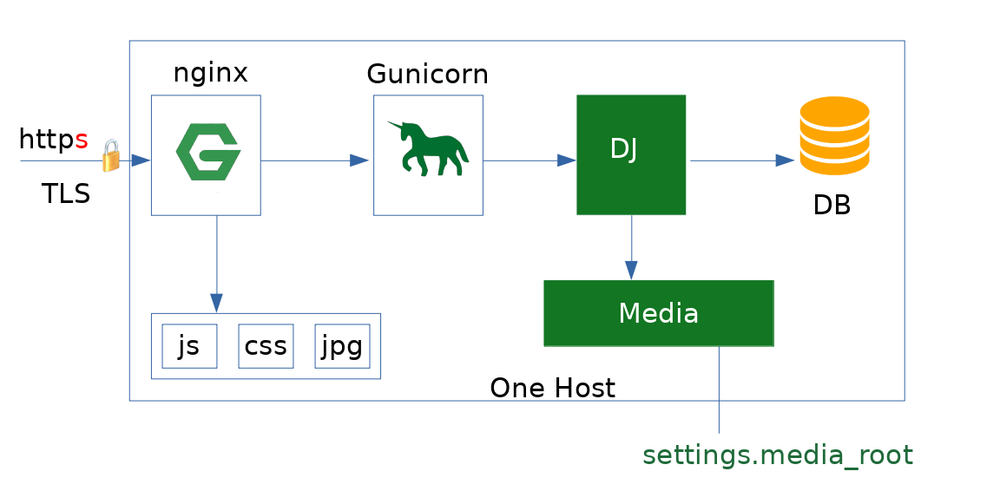

# Django in Production - From Zero to Hero

Pretty good start for ansible structure  to deploy a django application.

Usage
=======

    python -m venv .venv
    source .venv/bin/activate
    pip install ansible
    ansible-playbook ansible/deploy/deploy-demo.yml -i ansible/hosts -K

Links:
* [Django Lessons](https://django-lessons.com)
* [YouTube Playlist](https://www.youtube.com/watch?v=JzUwiux2YRo&list=PLlM3i4cwc8zBRQOGXuLrCLNfpVOuVLuwZ)

Description of each Lesson
===========================

[Lesson #18 - Django in Production - From Zero to Hero - Part-1](https://django-lessons.com/lesson/lesson-18-django-deploy-production-step-by-step-from-zero-to-hero-part-1)

In this lesson we prepare a VPS. We secure ssh connection with repote VPS via
public key authentication. We learn how to configure local ssh client so that
we will type less in future - this configuration will ease setup of ansible
hosts file in future lesson.

[Lesson #19 - Django in Production - From Zero to Hero - Part-2](https://django-lessons.com/lesson/lesson-19-django-deploy-production-step-by-step-from-zero-to-hero-part-2)

In this part we learn the role of web server - nginx in our case - and how to it up.
I explain in very detail the structure of nginx's site configuration file and most importantly
the server, location and alias directives and their roles in serving static content.

[Lesson #20 - Django in Production - From Zero to Hero - Part-3](https://django-lessons.com/lesson/lesson-20-django-deploy-production-step-by-step-from-zero-to-hero-part-3)

In introduce Ansible here - which is de facto standard automation tool in
devops world. I explain in detail about inventory file, playbook's and roles
files structure.

[Lesson #21 - Django in Production - From Zero to Hero - Part-4](https://django-lessons.com/lesson/lesson-20-django-deploy-production-step-by-step-from-zero-to-hero-part-4)

In this lesson we setup Ansible's db role. I explain how to add steps to
automate adding a new repository, create a database and add a user (with password).
I will show you commands to add user/database manual way as well, because it is not
a big deal anyway.